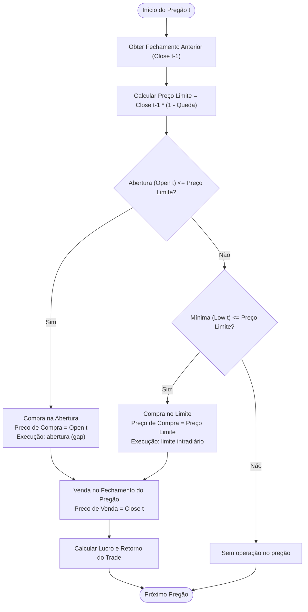

# Backtest de Estratégia de Ações da B3 em Python

Projeto em desenvolvimento voltado para análise quantitativa e simulação histórica (*backtest*) de estratégias de negociação em ações listadas na B3 (Brasil, Bolsa, Balcão). O sistema obtém dados de mercado, simula a execução de operações intradiárias com base em variações de preço, calcula métricas de desempenho e emite relatórios analíticos no terminal.

Este repositório foi concebido como um projeto prático de aprendizado aplicado, focado em lógica de programação com Python, tratamento de séries temporais financeiras e boas práticas de estruturação de algoritmos de investimento.

---

## Sumário

- [Visão Geral](#visão-geral)
- [Estratégia de Negociação](#estratégia-de-negociação)
  - [Lógica Operacional](#lógica-operacional)
  - [Fluxo de Execução](#fluxo-de-execução)
  - [Exemplo Numérico](#exemplo-numérico)
- [Tecnologias Utilizadas](#tecnologias-utilizadas)
- [Funcionalidades Implementadas](#funcionalidades-implementadas)
- [Métricas e Estatísticas Calculadas](#métricas-e-estatísticas-calculadas)
- [Particularidades de Preços e Proventos](#particularidades-de-preços-e-proventos)
- [Instalação e Execução](#instalação-e-execução)
  - [Pré-requisitos](#pré-requisitos)
  - [Passo a Passo (Windows PowerShell)](#passo-a-passo-windows-powershell)
  - [Configuração de Parâmetros](#configuração-de-parâmetros)
- [Exemplo de Utilização e Relatório](#exemplo-de-utilização-e-relatório)
- [Limitações e Cuidados](#limitações-e-cuidados)
- [Melhorias Futuras](#melhorias-futuras)
- [Licença](#licença)

---

## Visão Geral

O objetivo deste projeto é fornecer uma rotina automatizada e reprodutível para simular estratégias de compra em quedas pontuais de pregões anteriores, avaliando o comportamento do ativo ao longo de um horizonte histórico selecionado.

O script executa a coleta de dados diários diretamente do Yahoo Finance, trata a formatação dos dados, valida a consistência das séries temporais, simula a execução de ordens do tipo *day trade* e consolida os resultados estatísticos em três visões analíticas complementares:
1. **Relatório Principal (Preços Nominais):** estatísticas gerais da estratégia.
2. **Diagnóstico de Eventos Corporativos:** impacto de dividendos e desdobramentos (*splits*) nas datas em que ocorreram.
3. **Comparação de Preços:** contraste direto de métricas entre dados nominais e ajustados (*split/dividend-adjusted*).

---

## Estratégia de Negociação

### Lógica Operacional

A estratégia testada é uma operação de retorno à média de curtíssimo prazo (*day trade*), que busca comprar um ativo quando ele sofre uma desvalorização predeterminada em relação ao encerramento do pregão anterior, encerrando a posição obrigatoriamente no fechamento do mesmo dia.

Para cada pregão $t$ em relação ao pregão imediatamente anterior $t-1$:

1. **Preço de Referência:** Obtém-se o preço de fechamento do dia anterior ($\text{Close}_{t-1}$).
2. **Cálculo do Preço-Limite:** Define-se o valor máximo aceitável para compra aplicando o percentual configurado de queda ($\text{queda}$):
   $$\text{Preço Limite} = \text{Close}_{t-1} \times (1 - \text{queda})$$
3. **Condição 1 — Entrada por Gap de Baixa:**
   - Se o preço de abertura do dia atual for menor ou igual ao preço-limite ($\text{Open}_t \le \text{Preço Limite}$), a compra é executada imediatamente no preço de abertura ($\text{Preço de Compra} = \text{Open}_t$).
4. **Condição 2 — Entrada por Limite Intradiário:**
   - Caso a abertura não tenha atingido o limite, mas a mínima do dia tenha tocado ou ultrapassado o patamar ($\text{Low}_t \le \text{Preço Limite}$), a compra é considerada executada exatamente no preço-limite ($\text{Preço de Compra} = \text{Preço Limite}$).
5. **Sem Operação:**
   - Se a mínima do dia for superior ao preço-limite ($\text{Low}_t > \text{Preço Limite}$), a condição de entrada não foi satisfeita e nenhuma ordem é executada no pregão.
6. **Saída Obrigatória:**
   - Havendo entrada, a posição é liquidada no preço de fechamento do mesmo pregão ($\text{Preço de Venda} = \text{Close}_t$).
7. **Resultado da Operação:**
   - Lucro financeiro por ação: $\text{Lucro} = \text{Preço de Venda} - \text{Preço de Compra}$
   - Retorno percentual do trade: $\text{Retorno} = \frac{\text{Lucro}}{\text{Preço de Compra}}$

### Fluxo de Execução



### Exemplo Numérico

Considere os seguintes parâmetros hipotéticos:
- **Percentual de queda para compra:** $1{,}00\%$ (`0.01`)
- **Fechamento do dia anterior ($\text{Close}_{t-1}$):** $\text{R\$\ } 50{,}00$
- **Preço-limite calculado:** $\text{R\$\ } 50{,}00 \times (1 - 0{,}01) = \text{R\$\ } 49{,}50$

* **Cenário A (Gap de baixa):**
  - O ativo abre em $\text{R\$\ } 49{,}20$ (abaixo de $\text{R\$\ } 49{,}50$).
  - **Compra:** $\text{R\$\ } 49{,}20$.
  - Se fechar o dia a $\text{R\$\ } 50{,}18$, o retorno será:
    $$\text{Retorno} = \frac{50{,}18 - 49{,}20}{49{,}20} = +1{,}99\%$$

* **Cenário B (Gatilho intradiário):**
  - O ativo abre a $\text{R\$\ } 49{,}80$, mas ao longo do dia atinge a mínima de $\text{R\$\ } 49{,}40$.
  - Como a mínima furou o limite de $\text{R\$\ } 49{,}50$, a ordem limite é executada a $\text{R\$\ } 49{,}50$.
  - Se o pregão fechar a $\text{R\$\ } 49{,}00$, o retorno será:
    $$\text{Retorno} = \frac{49{,}00 - 49{,}50}{49{,}50} = -1{,}01\%$$

* **Cenário C (Sem gatilho):**
  - O ativo abre a $\text{R\$\ } 50{,}20$ e faz mínima em $\text{R\$\ } 49{,}70$. O limite de $\text{R\$\ } 49{,}50$ nunca foi tocado; nenhum trade é realizado.

---

## Tecnologias Utilizadas

O projeto faz uso de um conjunto enxuto de ferramentas do ecossistema de dados em Python:

- **[Python](https://www.python.org/) (versão 3.10+)**: Linguagem base utilizada para desenvolvimento do algoritmo.
- **[yfinance](https://github.com/ranaroussi/yfinance)**: Biblioteca responsável pelo consumo e download de séries históricas de preços (OHLCV) e eventos corporativos da base do Yahoo Finance.
- **[pandas](https://pandas.pydata.org/)**: Manipulação de estruturas de dados tabulares (`DataFrame` e `Series`), tratamento de valores ausentes, ordenação temporal e cálculos estatísticos.

---

## Funcionalidades Implementadas

O arquivo [`main.py`](file:///c:/Users/joao.cunico/Documents/Backtest/Novo-backtest-B3/main.py) contém as seguintes capacidades em pleno funcionamento:

- **Download Automatizado de Dados Históricos:**
  - Consulta remota de ativos com sufixo da B3 (exemplo: `VALE3.SA`, `PETR4.SA`).
  - Suporte a períodos arbitrários (`1y`, `2y`, `6mo`, etc.).
  - Captura simultânea de eventos corporativos (dividendos e desdobramentos de ações via parâmetro `actions=True`).
- **Tratamento e Validação de Dados:**
  - Compatibilidade com formatos de colunas simples e `MultiIndex` retornados por versões recentes do `yfinance`.
  - Validação estrita da presença das colunas mínimas exigidas (`Open`, `Low`, `Close`, `Volume`).
  - Limpeza de linhas incompletas (`dropna`) e verificação de quantidade mínima de pregões disponíveis (mínimo de 2 dias).
- **Simulação da Estratégia:**
  - Identificação de gatilhos por abertura (gap) ou mínima diária.
  - Gravação individual de cada operação realizada, contendo data, preços praticados, lucro financeiro, percentual de retorno e etiqueta de execução.
- **Tratamento de Proventos e Eventos Corporativos:**
  - Função dedicada a mapear e listar todos os pregões em que houve pagamento de dividendos ou desdobramentos, indicando se a estratégia gerou trade no dia e qual foi o comportamento do preço.
- **Emissão de Relatórios Formatados:**
  - Saída estruturada no terminal com métricas consolidadas, lista de eventos e tabela comparativa entre preços nominais e ajustados.

---

## Métricas e Estatísticas Calculadas

Todas as estatísticas são computadas pela função `calcular_estatisticas` e descritas a seguir:

| Métrica | Identificador no Código | Descrição e Fórmula |
| :--- | :--- | :--- |
| **Total Trades** | `total_trades` | Número total de operações executadas ao longo do período analisado. |
| **Total Gain** | `total_gain` | Quantidade de operações encerradas com lucro positivo ($\text{retorno} > 0$). |
| **% Gain** | `percentual_gain` | Proporção percentual de operações vencedoras: $\frac{\text{total\_gain}}{\text{total\_trades}} \times 100$. |
| **Total Loss** | `total_loss` | Quantidade de operações encerradas com prejuízo ($\text{retorno} < 0$). |
| **% Loss** | `percentual_loss` | Proporção percentual de operações perdedoras: $\frac{\text{total\_loss}}{\text{total\_trades}} \times 100$. |
| **Trades no zero a zero** | `trades_zero_a_zero` | Número de operações com retorno neutro ($\text{retorno} == 0$), obtido por $\text{total\_trades} - \text{total\_gain} - \text{total\_loss}$. |
| **Resultado** | `resultado` | **Soma simples dos retornos percentuais** de todas as operações: $\sum \text{retornos}$. *Nota: Não aplica juros compostos nem curva acumulada ponderada por capital.* |
| **Max DrawDown** | `max_drawdown` | **Pior perda percentual observada em uma única operação** ($\min(0{,}0, \min(\text{retornos}))$). *Ver detalhamento abaixo.* |
| **Ganho Máximo** | `ganho_maximo` | Maior retorno percentual individual registrado entre todos os trades realizados ($\max(\text{retornos})$). |
| **Ganho Médio** | `ganho_medio` | Retorno percentual médio por operação considerando **todas as operações** (ganhos e perdas): $\frac{\text{resultado}}{\text{total\_trades}}$. |
| **Volume Financeiro Médio** | `volume_financeiro_medio` | Média diária do produto do Volume pelo Preço de Fechamento em todos os pregões analisados: $\text{mean}(\text{Volume} \times \text{Close})$. |

> [!IMPORTANT]
> **Particularidade do Max DrawDown nesta implementação:**
> No código atual, a métrica `max_drawdown` (e `maior_drawdown`) **não** representa o drawdown tradicional de curva de capital acumulada (queda pico-a-fundo do patrimônio ao longo do tempo). Ela foi implementada para registrar a **maior perda percentual ocorrida em um único trade individual**, alinhando-se à forma como certas plataformas de referência de trading exibem essa estatística específica por operação.

---

## Particularidades de Preços e Proventos

O script foi concebido para diferenciar o impacto do ajuste de preços por dividendos e desdobramentos:

1. **Execução Principal com Preços Nominais (`auto_adjust=False`):**
   - Na rotina padrão, o backtest utiliza as cotações nominais registradas nos pregões da época.
2. **Comparação com Preços Ajustados (`auto_adjust=True`):**
   - O código executa paralelamente a mesma simulação com as cotações retroativamente ajustadas pelo Yahoo Finance.
   - O relatório comparativo final exibe lado a lado as diferenças nas métricas, permitindo avaliar se distorções artificiais de preços (como quedas em dias *ex-dividendos*) afetaram a quantidade de entradas e o resultado da estratégia.

---

## Instalação e Execução

### Pré-requisitos

- **Python 3.10 ou superior** instalado no sistema.
- Acesso à internet para download das cotações pelo Yahoo Finance.

### Passo a Passo (Windows PowerShell)

Abra o terminal do Windows PowerShell e siga as etapas:

1. **Obter o repositório:**
   ```powershell
   git clone <URL_DO_REPOSITORIO>
   cd Novo-backtest-B3
   ```

2. **Abrir no Visual Studio Code (opcional):**
   ```powershell
   code .
   ```

3. **Criar e ativar um ambiente virtual:**
   ```powershell
   python -m venv .venv
   .\.venv\Scripts\Activate.ps1
   ```
   > *Caso ocorra restrição de política de scripts no PowerShell, execute antes: `Set-ExecutionPolicy -Scope Process -ExecutionPolicy Bypass`.*

4. **Instalar as dependências:**
   ```powershell
   pip install yfinance pandas
   ```

5. **Executar o backtest:**
   ```powershell
   python main.py
   ```

### Configuração de Parâmetros

Os parâmetros do teste são definidos diretamente na função `main()` do arquivo [`main.py`](file:///c:/Users/joao.cunico/Documents/Backtest/Novo-backtest-B3/main.py):

```python
def main():
    ticker = "VALE3.SA"          # Código de negociação da B3 acompanhado de .SA
    periodo = "1y"               # Intervalo histórico aceito pelo yfinance (ex: 6mo, 1y, 2y, 5y)
    queda_para_compra = 0.01     # Percentual de queda em relação ao fechamento anterior (0.01 = 1%)
```

Para testar outro ativo ou percentual (por exemplo, `PETR4.SA` com queda de `2%` em um período de `2 anos`), basta alterar as variáveis correspondentes e salvar o arquivo.

---

## Exemplo de Utilização e Relatório

Abaixo é exibido um exemplo puramente **ilustrativo** da saída gerada no terminal (com valores fictícios para fins de demonstração da formatação):

```text
========== RELATORIO - PRECOS NOMINAIS ==========
Total Gain: 42
% Gain: 56.76%
Total Loss: 31
% Loss: 41.89%
Total Trades: 74
Resultado: 14.85%
Max DrawDown: -3.210%
Ganho Maximo: 4.15%
Ganho Medio: 0.20%
Volume Financeiro Medio: 1250340912.40
Trades no zero a zero: 1

========== EVENTOS CORPORATIVOS ==========
Data: 2024-03-15 | Close anterior: 68.20 | Open: 67.10 | Low: 66.80 | Close: 67.50 | Limite: 67.52 | Dividendo: 2.1500 | Split: 0.0000 | Trade: sim | Compra: 67.10 | Retorno: 0.5961%

========== COMPARACAO DE PRECOS ==========
Metrica                   Ajustados        Nominais
Total Trades                     72              74
Total Gain                       40              42
Total Loss                       31              31
Resultado                   11.240%         14.850%
Max DrawDown                -3.210%         -3.210%
Ganho Maximo                 3.890%          4.150%
Ganho Medio                  0.156%          0.201%
```

---

## Limitações e Cuidados

- **Simulação Teórica sem Custos:** O modelo atual não considera taxas da B3 (emolumentos e taxa de liquidação), corretagem ou tributação (imposto de renda sobre day trade).
- **Hipótese de Liquidez e Execução:** Pressupõe-se que qualquer ordem limite que toque o patamar seja 100% preenchida no preço exato, desconsiderando filas de ordens no *book*, *slippage* e *spread* entre compra e venda.
- **Origem dos Dados:** A biblioteca `yfinance` consulta dados públicos do Yahoo Finance, sujeitos a eventuais atrasos, indisponibilidades da API ou pequenas discrepâncias de ajuste.
- **Interpretação do Retorno:** O percentual total de resultado é uma soma simples de retornos unitários e não simula a evolução de uma conta de capital com dimensionamento de lote (*position sizing*) ou juros compostos.
- **Risco de Mercado:** Retornos obtidos em dados históricos não representam nem garantem rentabilidade futura.

---

## Melhorias Futuras

O projeto encontra-se em constante evolução. Entre as melhorias planejadas para versões futuras estão:

- [ ] **Simulação em Lote (*Batch Backtest*):** Permitir a análise de carteiras inteiras ou de todos os ativos do índice IBOVESPA de forma simultânea.
- [ ] **Inclusão de Custos Operacionais:** Adicionar parâmetros configuráveis para taxas da B3 e custos de corretagem.
- [ ] **Métricas de Risco Avançadas:** Implementar o cálculo clássico de *Max Drawdown* sobre a curva de capital acumulada, além de métricas como *Índice Sharpe*, *Índice Sortino* e *Profit Factor*.
- [ ] **Gestão de Capital:** Permitir simulação com saldo inicial definido (R$) e regras de dimensionamento de posição (*fixed risk* ou número fixo de ações).
- [ ] **Exportação de Dados:** Exportar o diário detalhado de trades e as estatísticas para arquivos CSV ou planilhas Excel (`.xlsx`).
- [ ] **Visualização Gráfica:** Desenvolver gráficos de curva de patrimônio, *drawdown chart* e histograma de retornos via `matplotlib` ou através de uma interface interativa com `Streamlit`.

---

## Licença

Este projeto é destinado a fins educacionais e de estudo pessoal. Consulte os termos do repositório para detalhes sobre direitos de uso.

